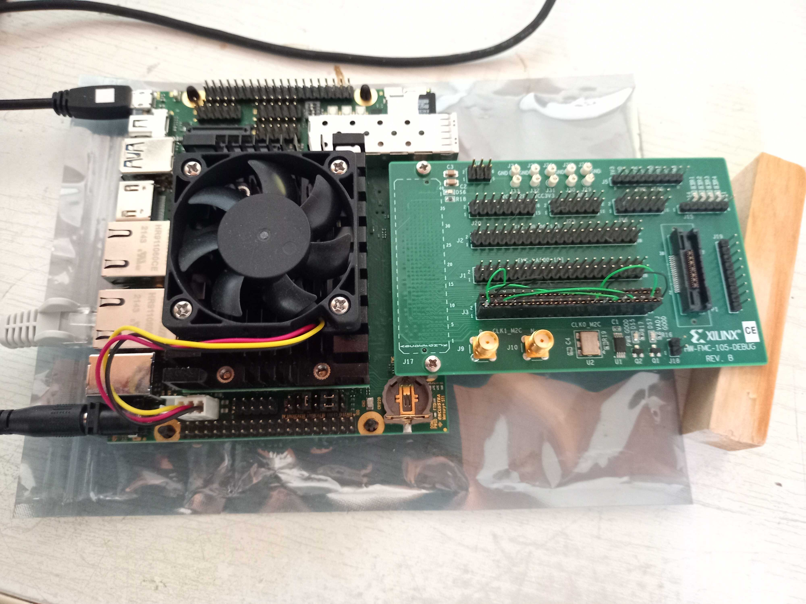
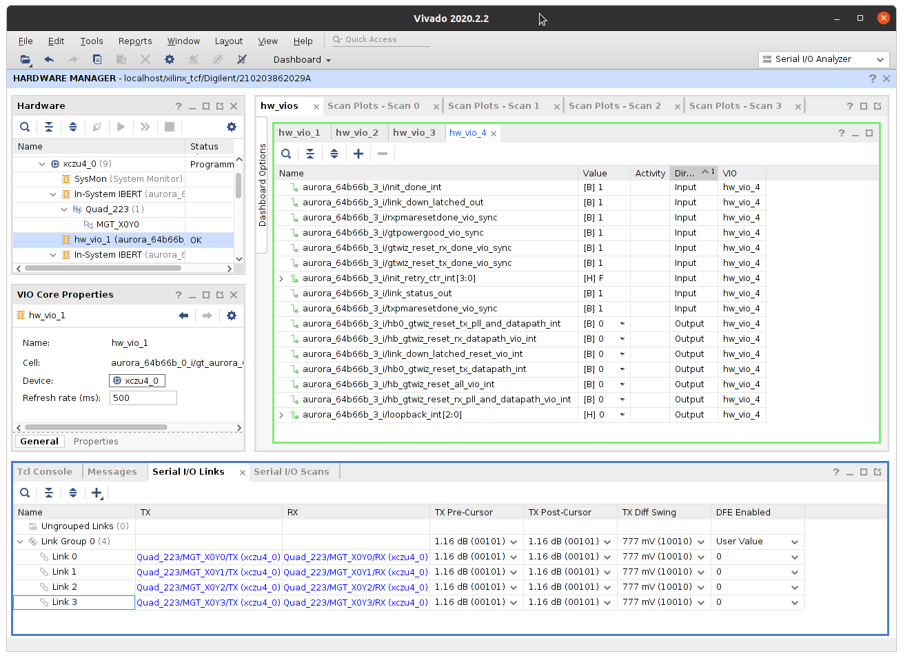
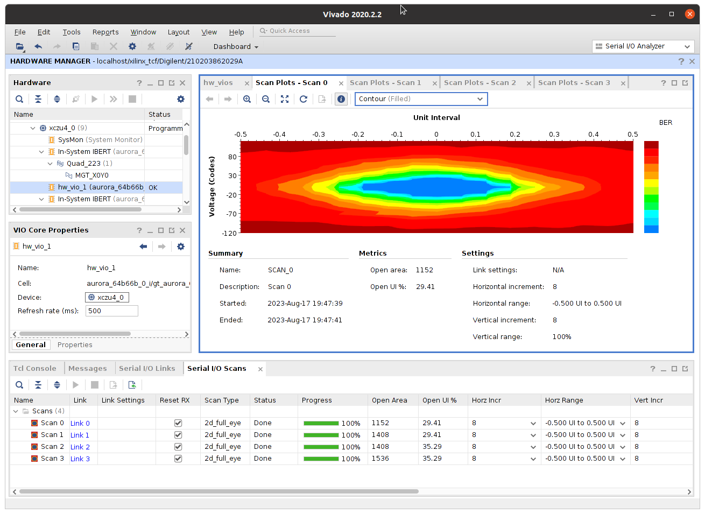
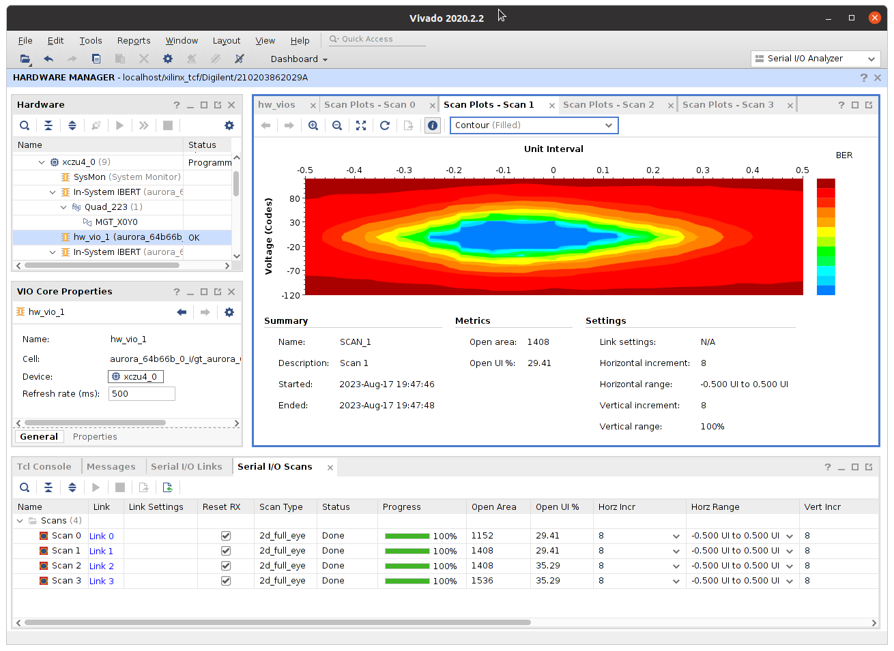
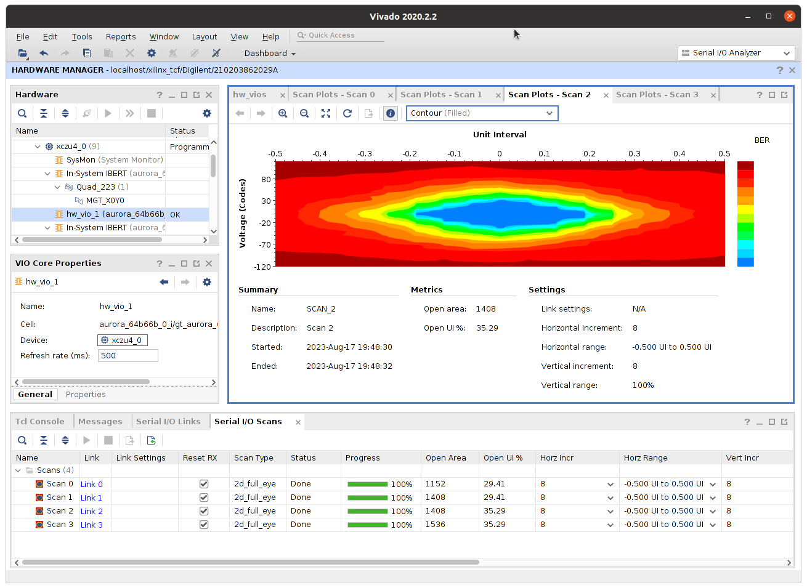
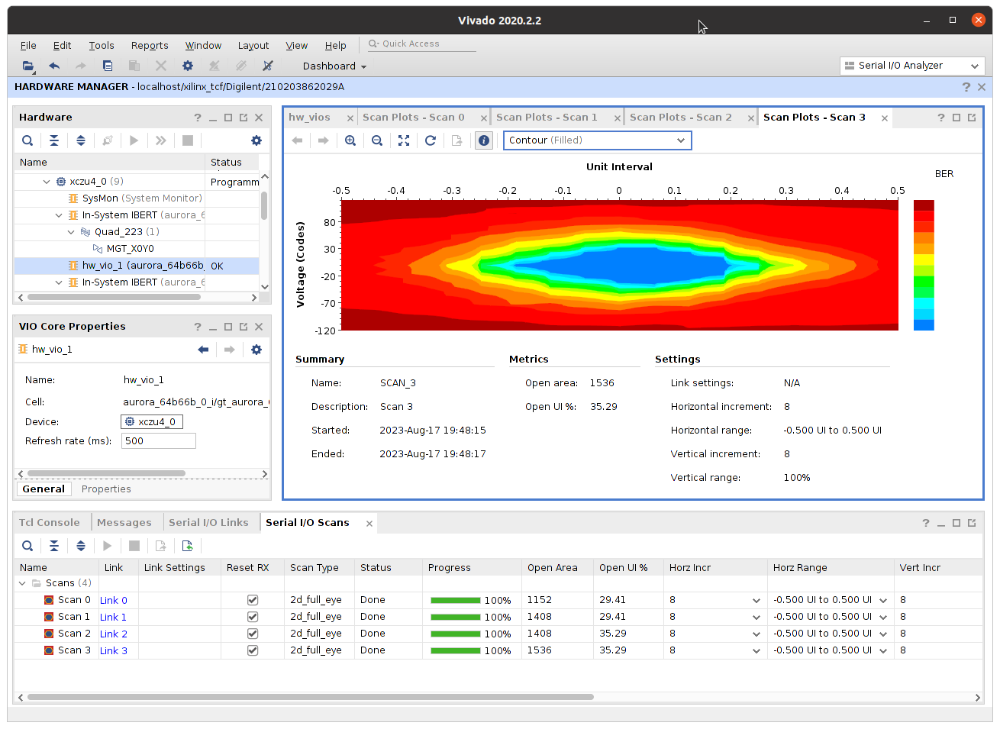

---

**xu8_fmcxm105**  
Mercury XU8 and ST1 with Xilinx FMC XM-105 (UG537).  
Project is set to test GTH X0Y0 links with IBERT. 4x GTH IPs are configured as 64b66b Aurora 6.25Gbps.  
Connector FMC-HA on picture has cross-wire connection `RX0/TX0 <-> RX2/TX2` and `RX1/TX1 <-> RX3/TX3`.  
  
  
  
  
  
  
  

---
