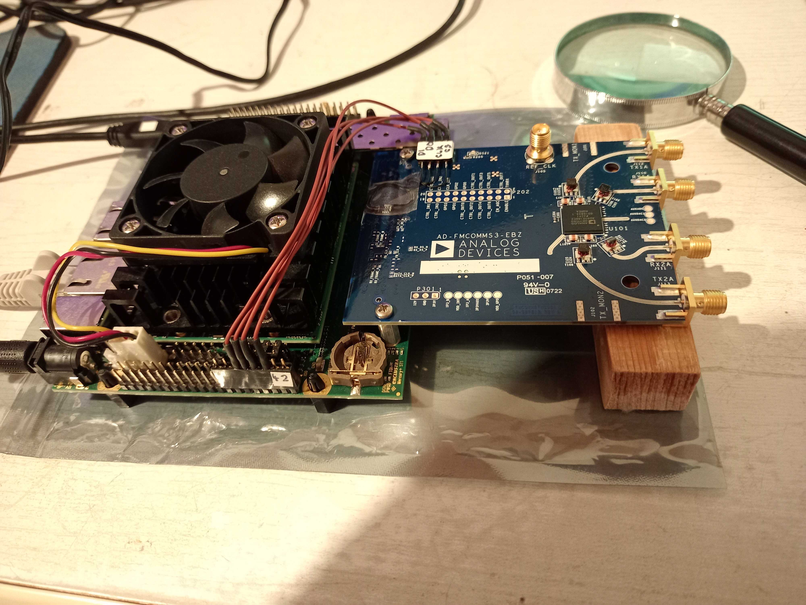
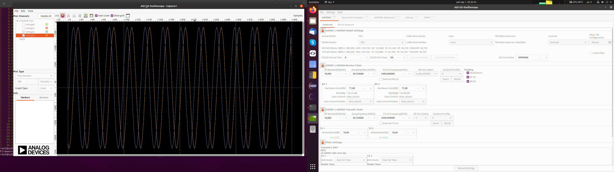
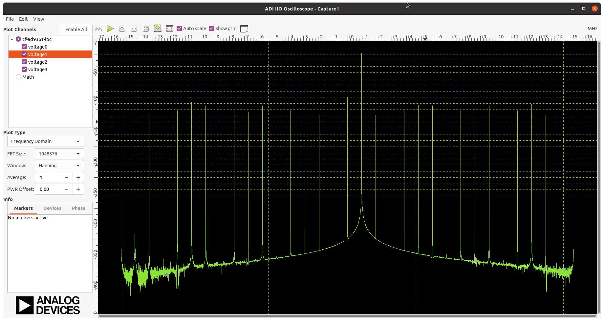

---  
**Build Analog hdl-analog IP repo**  
```
source ~/opt/Xilinx/Vivado/2020.2/settings64.sh
cd ./hdl-analog
make lib
```

---

---  
**FWID: mmddnn**  
```  
mm=1..12, dd=01..31, nn=1..
e.g. 2012 -> mm=2, dd=01, nn=2
```

---
**xu8_fmcxm105**  
Mercury XU8 and ST1 with Xilinx FMC XM-105 (UG537).  
Project is set to test GTH X0Y0 links with IBERT. 4x GTH IPs are configured as 64b66b Aurora 6.25Gbps.  
Connector FMC-HA on picture has cross-wire connection `RX0/TX0 <-> RX2/TX2` and `RX1/TX1 <-> RX3/TX3`.  
  
  
  
  
  
  
  

---
**xu8_fmcomms3**  
Mercury XU8 ST1 with Analog AD-FMCOMMS3-EBZ board.
NOTE: Some simple HW patching on AD-FMCOMMS3 board is needed. See [README.md](./xu8_fmcomms3/README.md).
  
  
  
  
---

