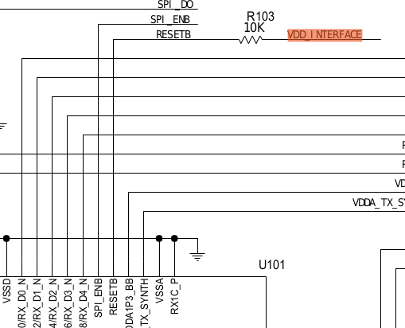
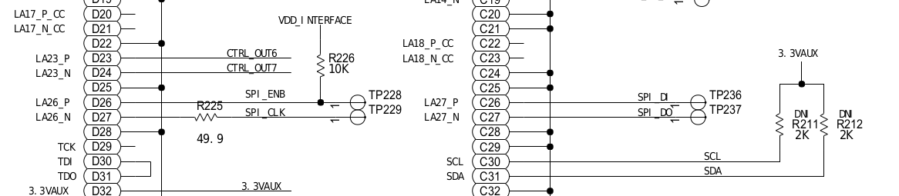
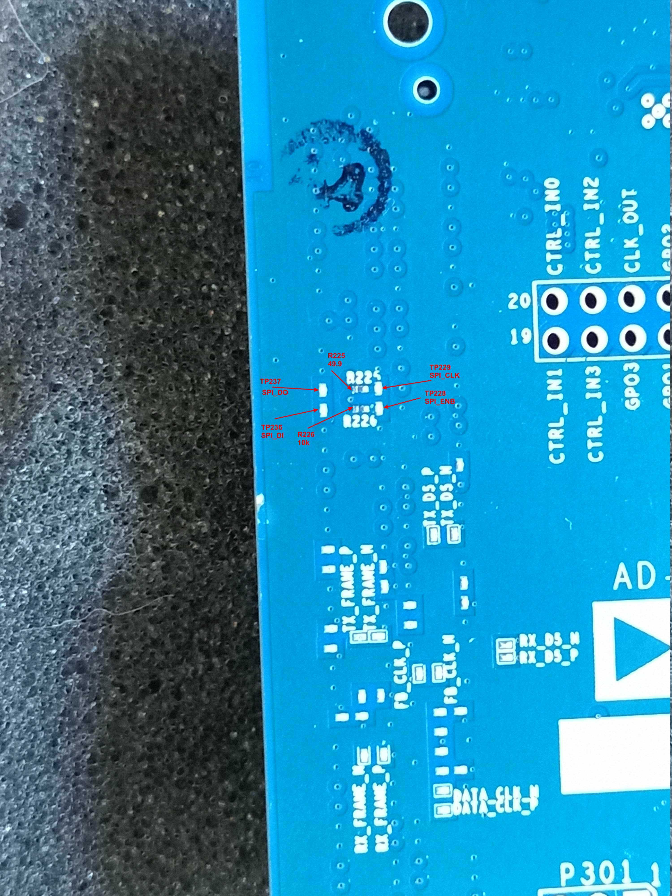
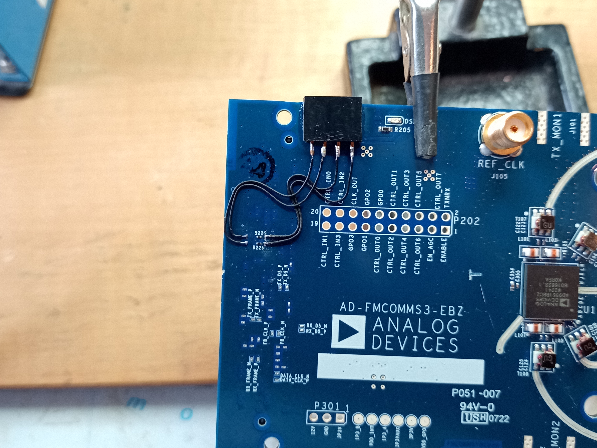
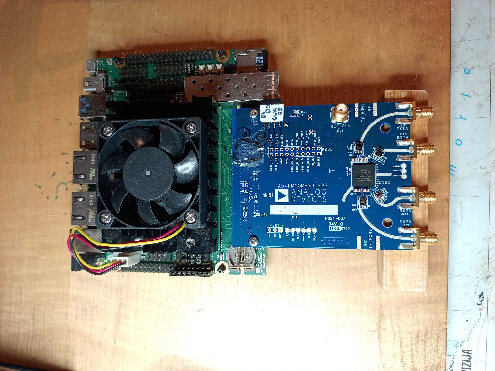
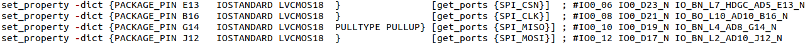

---

**xu8_fmcomms3**  

FPGA design for XU8 AD-FMCOMMS3 project.

```
cd ./xu8_fmcomms3
source ~/opt/Xilinx/Vivado/2020.2/settings64.sh
vivado -mode batch -source xu8_fmcomms3_vivado_project.tcl
vivado project_xu8_fmcomms2/xu8_fmcomms3.xpr
```
---

Because of missing some FMC connections, HW patching on AD-FMCOMMS3 board is needed.  

**Important NOTE:**  
**You can destroy your HW boards by HW patching!**  
You must know and be aware of what you are doing. If you are not, than don't do it.  
Complete and whole resposability on HW patching result is on you.  
You have been warned.  

**Missing ST1 FMC to AD-FMCOMMS3 connections:**  

```
LA28_P	RESETB 	Input Active Low input, pull up to VADJ(1V8) on AD-FMCOMMS3
LA25_P	CTRL_I_N2 	Input Control input
LA25_N	CTRL_I_N3 	Input Control input
LA26_P	SPI_ENB 	Input
LA26_N	SPI_CLK 	Input
LA27_P	SPI_DI 	Input
LA27_N	SPI_DO 	Output
```

**RESETB**  
RESETB signal is pulled up on AD-FMCOMMS3-EBZ board.  
No way to solve this easely, so no HW reset of AD9361 chip is possible.  
  

**CTRL_I_N2 and CTRL_IN3**  
GPIO_CTRL[2] and GPIO_CTRL[3] signals are not available via FMC connector.  

**SPI signals**  

SPI signals on AD-FMCOMMS3-EBZ schematic.  
   

All four SPI signals have test points (TP228, TP229, TP236, TP237) on top PCB.  
   

Solder wires from SPI test points to connector. Read first the `**Important NOTE:**` and warning from above!  
   
   

SPI wires from AD-FMCOMMS3-EBZ board are connected to ST1 Anios IO0 connector pins 6, 8, 10 and 12.  
Note the MISO MOSI wire crossing.  
  

---

**Known problems**  
- AD7291 on AD-FMCOMMS3 board is not detected on I2C_FPGA bus. At the moment this is unknown reason.

---

