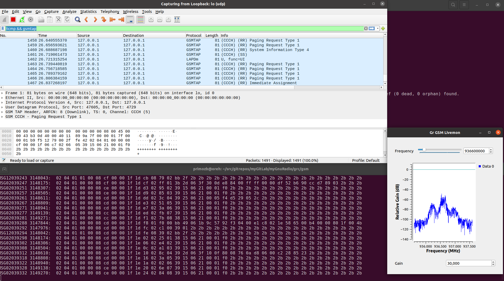
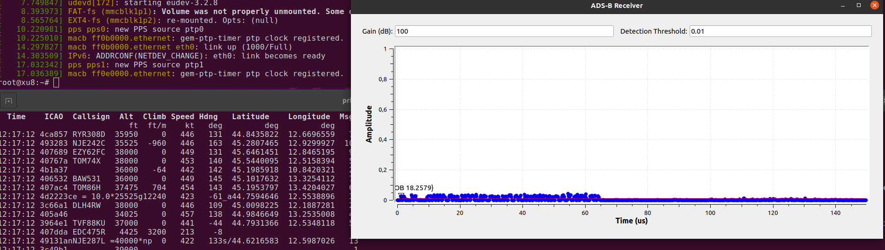

---

Hint: Read first this doc from top to bottom, before installing and building.  
There are for sure other ways to install and/or build needed packages.  
Description here is my way.  

---

**Install GNU Radio 3.8.5.0 on Ubuntu 20.04-LTS**

Link to GNU Radio install [Ubuntu Install](https://wiki.gnuradio.org/index.php/UbuntuInstall).  

Add PPA sources:  
```
sudo add-apt-repository ppa:gnuradio/gnuradio-releases-3.8
sudo apt-get update
```

Install packages:  
```
sudo apt install libboost-all-dev libgmp-dev python3-numpy python3-sphinx libqwt-qt5-dev libqt5opengl5-dev libzmq3-dev python3-click-plugins python3-scipy libcodec2-dev libgsm1-dev pybind11-dev python3-matplotlib libsndfile1-dev libsoapysdr-dev soapysdr-tools
```

Needed by gr-iio:  
`sudo apt-get install liborc-dev`

Needed by gr-gsm:  
```
sudo apt install libosmocodec0 libosmocoding0 libosmocore libosmocore-dev libosmocore-utils libosmocore11 libosmoctrl0 libosmogb6 libosmogsm10 libosmosdr-dev libosmosdr0 libosmosim0 libosmovty4 soapyosmo-common0.7 soapysdr0.7-module-osmosdr
```

Needed by iio-oscilloscope:  
```
sudo apt install libcurl4-openssl-dev libserialport-dev
```

Suggested packages:  
```
sudo apt install gr-osmosdr gr-fosphor libcppunit-doc libvolk2-doc python-networkx-doc python3-gdal python3-pygraphviz python3-pydot libgle3 libgle3-dev python-pyqt5.qwt-doc python-pyqtgraph-doc
```
---

**Build libiio**  
Clone git repo `git@github.com:pbeltram/libiio.git`  
Checkout branch `pb_enclustra_2020.2_devel` (origin tag v0.23)  
Build:  
```
mkdir build
cmake ..
make
sudo make install
sudo ldconfig
cd ..
```
List of installed files are in `./build/install_manifest.txt`.  
Uninstall:  
```
sudo -s
cat ./install_manifest.txt | xargs ls
cat ./install_manifest.txt | xargs rm --
#remove empty dirs from install_manifest.txt
#e.g. cat ./install_manifest.txt | xargs -L1 dirname | xargs ls
exit
sudo ldconfig
```

---

**Build libad9361-iio**  
Clone git repo `git@github.com:pbeltram/libad9361-iio.git`  
Checkout branch `pb_enclustra_2020.2_devel` (origin tag v0.3)  
Build:  
```
mkdir build
cmake ..
make
sudo make install
sudo ldconfig
cd ..
```
List of installed files are in `./build/install_manifest.txt`.  
Uninstall:  
```
sudo -s
cat ./install_manifest.txt | xargs ls
cat ./install_manifest.txt | xargs rm --
#remove empty dirs from install_manifest.txt
#e.g. cat ./install_manifest.txt | xargs -L1 dirname | xargs ls
exit
sudo ldconfig
```

---

**Build gr-iio**  

**NOTE from Analog site:**  
 If you are using gnuradio 3.10 or newer gr-iio is already provided within the base install of gnuradio itself. 3.9 is not supported in any form by gr-iio.  

Clone git repo `git@github.com:pbeltram/gr-iio.git`  
Checkout branch `pb_enclustra_2020.2_devel` (origin branch upstream/upgrade-3.8 commit abb2816d83dcf65f105902f2947b96570a7b7ccf).  

Build:  
```
mkdir build
cmake ..
make
sudo make install
sudo ldconfig
cd ..
```
List of installed files are in `./build/install_manifest.txt`.  
NOTE: Installed `gr-iio` python module name `iio`, conflicts with `pylibiio` (also `iio` but in different directory `~/.local/lib/python3.8/site-packages/`).

Uninstall:  
```
sudo -s
cat ./install_manifest.txt | xargs ls
cat ./install_manifest.txt | xargs rm --
#remove empty dirs from install_manifest.txt
#e.g. cat ./install_manifest.txt | xargs -L1 dirname | xargs ls
exit
sudo ldconfig
```

--- 

**Build gr-adsb**  
Clone git repo `https://github.com/mhostetter/gr-adsb.git`  
Checkout branch master (origin commit 5d0361d208072574e1a3a200fca07c0b334f16d0).  
Build:  
```
mkdir build
cmake ..
make
sudo make install
sudo ldconfig
cd ..
```
List of installed files are in `./build/install_manifest.txt`.  

Uninstall:  
```
sudo -s
cat ./install_manifest.txt | xargs ls
cat ./install_manifest.txt | xargs rm --
#remove empty dirs from install_manifest.txt
#e.g. cat ./install_manifest.txt | xargs -L1 dirname | xargs ls
exit
sudo ldconfig
```

---

**Build gr-gsm**  
Clone git repo `git@github.com:ptrkrysik/gr-gsm.git`  
Checkout master branch (origin origin/master at commit 2de47e28ce1fb9a518337bfc0add36c8e3cff5eb).  
Build:  
```
mkdir build
cmake ..
make
sudo make install
sudo ldconfig
cd ..
```
List of installed files are in `./build/install_manifest.txt`.  

Uninstall:  
```
sudo -s
cat ./install_manifest.txt | xargs ls
cat ./install_manifest.txt | xargs rm --
#remove empty dirs from install_manifest.txt
#e.g. cat ./install_manifest.txt | xargs -L1 dirname | xargs ls
exit
sudo ldconfig
```
---

**NOTE:**  
GNU radio built and installed packages put their python modules in `/usr/local/lib/python3.8/site-packages`. This path is not in `gnuradio-companion` python modules search path and it fails to find modules (tried with PYTHONPATH but it does not help).  
One workaround to this problem is to create symbolic links form `/usr/local/lib/python3.8/dist-packages` to modules in `/usr/local/lib/python3.8/site-packages`, since `/usr/local/lib/python3.8/dist-packages` is in the python3 search path.  
Must be sudo to do it.  
```
cd /usr/local/lib/python3.8/dist-packages
ln -s ../site-packages/air_modes ./air_modes
ln -s ../site-packages/iio ./iio
ln -s ../site-packages/grgsm ./grgsm
```

---

**Running grgsm_livemon_uhd GNU Radio example**  

Compile with gnuradio-companion and then run `./grgsm_livemon_uhd.py`.  
To capture gsmtap run: `wireshark -k -f udp -Y '!icmp && gsmtap' -i lo`.  
  

---

**Running adsb_rx GNU Radio example**  

Compile with gnuradio-companion and then run `./adsb_rx.py`.  
  

---

