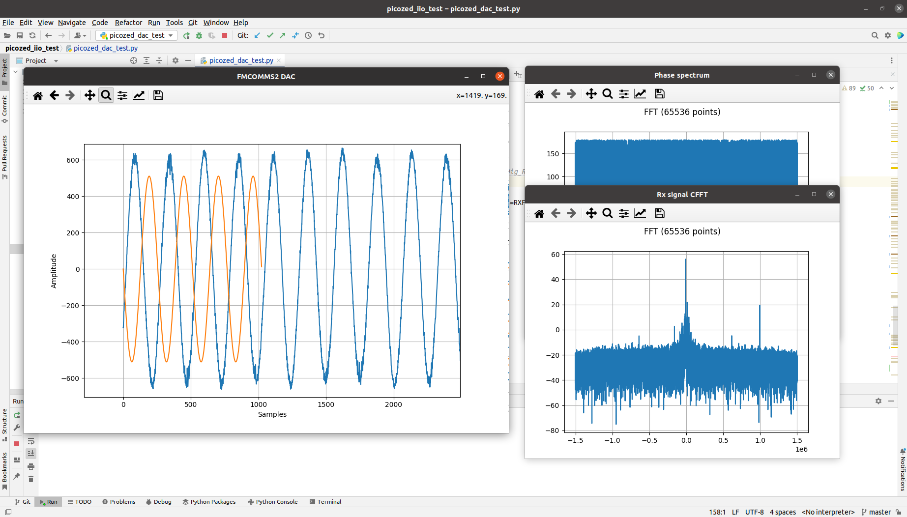

---  

**Python3 (3.8.10) dependencies**

```
python3 -m pip install --user --upgrade pip
python3 -m pip install --user pylibiio
python3 -m pip install --user numpy
python3 -m pip install --user scipy
python3 -m pip install --user PyQt5
python3 -m pip install --user matplotlib
```

---  

**NOTE:**
There is python module name conflict wtih `pylibiio` and GNU Radio `gr-iio`. Both declare `iio` python module in different directories.  
Workaround used here to coexist with GNU Radio, is to dynamically load pylibiio as libiio module.  
Other is to rename `~/.local/lib/python3.8/site-packages/iio.py` to `~/.local/lib/python3.8/site-packages/libiio.py` and then change all references from `iio` to `libiio`.  

---  

`fmcomms3_dac_test.py` test run on Ubuntu 20.04-LTS with python3.8.
  

---

