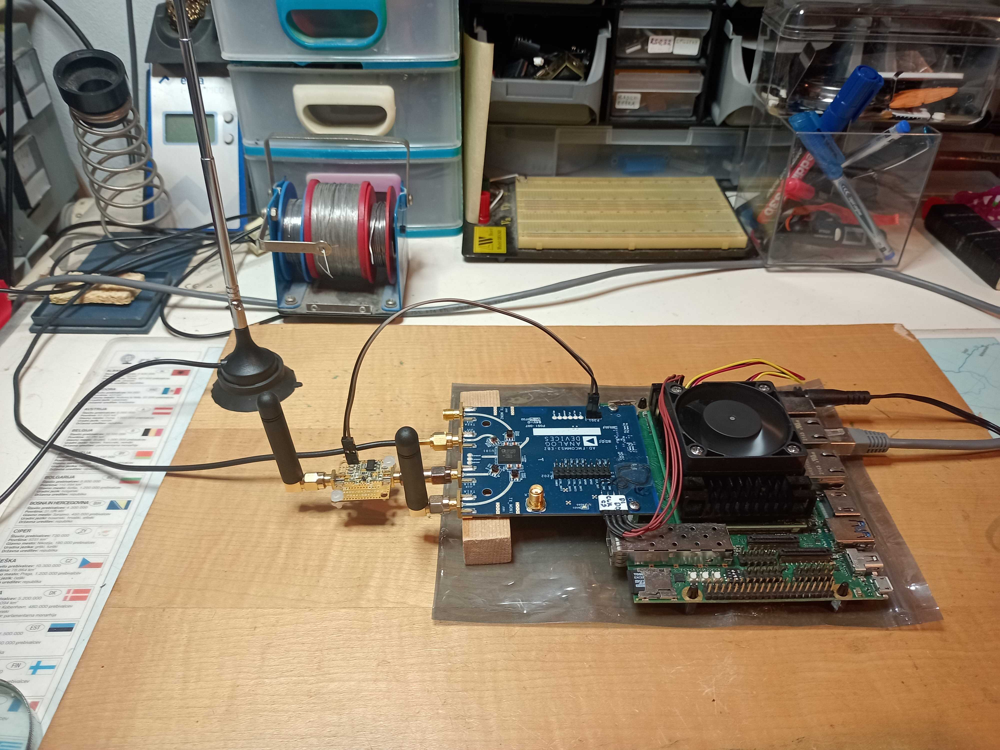

Capture in realtime IQ samples at 2.167 MSPS (OSR=8).  
Data is captured from HW (e.g. AD-FMCOMMS3 board) via IIO.  
Decode captured normal bursts and send gsmtaps to UDP port.  

  

**Building**  

Build on Ubuntu 20.04 LTE with standard libraries and build tools.  
Additional external libraries:  
libosmocodec0  
libosmocoding0  
libosmogsm10  
libosmocore-dev  

Using Eclipse IDE:  
`Eclipse IDE for GNU ARM & RISC-V C/C++ Developers`  
`Version: 2018-12 (4.10.0)`  
`Build id: 20190101-2023`  
`OS: Linux, v.5.4.0-167-generic, x86_64 / gtk 3.24.20, WebKit 2.38.6`  
`Java version: 1.8.0_201`  

Using Eclipse CDT:  
`Eclipse C/C++ Development Tools`  
`Version: 9.6.0.201812111211`  
`Build id: @build@`  
`(c) Copyright Eclipse contributors and others, 2000, 2010.`  
`Visit http://www.eclipse.org/cdt`  

---

**Running**  

`./Debug/gsm_passive_receiver_iio --input=ip:xu8 --arfcn=1 --uplink --nofa=80k --timeout=0 --mvalevel=0.3 --gain=7 --freqoff=-2700.0 --udpdest=127.0.0.1`

To capture gsmtaps run: 
`wireshark -k -f udp -Y gsmtap -i lo`

---

See LICENSE.md file too.

---
